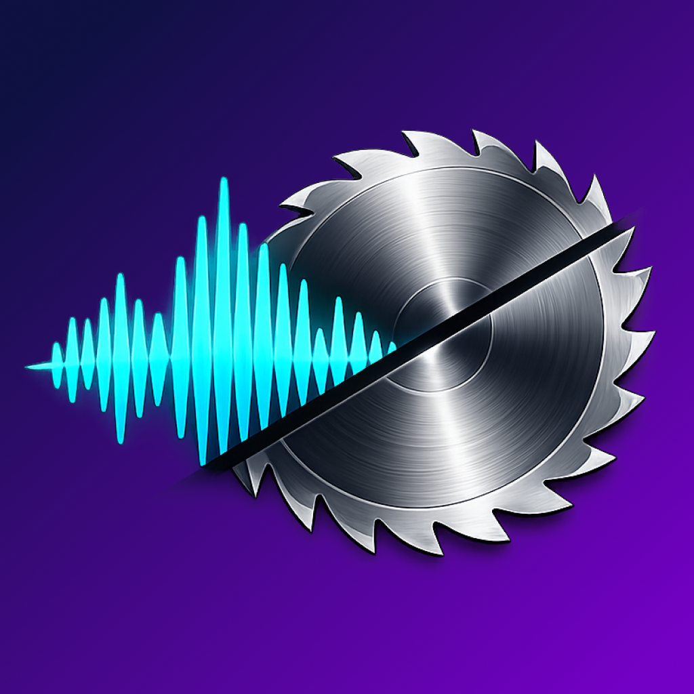

<p align="center">
  
</p>

<h1 align="center">Clipsaw</h1>

<p align="center">ローカル環境で動作する動画・音声カッター Web アプリ。Docker 上で完結し、ホスト環境を汚さない。</p>

長時間の録音・録画ファイルを任意の区間で分割・書き出す。複数ファイルにまたがる録音・録画にも対応し、事前結合してから作業できる。

## ユースケース

- バンド練習の 2 時間通し録音 (wav) → 曲ごとに mp3 で分割保存
- Podcast 用の長時間動画 (mp4) → 複数パートに分割
- ゲームプレイ録画 (mp4/mov) → 試合ごとに分割
- 録画ソフトが自動分割した複数ファイル → 結合してから分割

## 技術スタック

| レイヤー | 技術 |
|---|---|
| フレームワーク | Next.js 15 (App Router) + TypeScript |
| UI | shadcn/ui + Tailwind CSS (ダークテーマ) |
| 波形描画 | Canvas API |
| メディア処理 | FFmpeg (child_process) |
| DB | SQLite + Drizzle ORM |
| コンテナ | Docker (node:20-slim + ffmpeg) |

## セットアップ

```bash
git clone <repo-url> && cd clipsaw
```

分割したいメディアファイルを `input/` ディレクトリに配置する。

```bash
mkdir -p input output data
# input/ にメディアファイルを置く
```

## 使い方

### 開発モード (ホットリロード)

```bash
make dev
```

### 本番モード

```bash
make prod
```

いずれも http://localhost:3501 でアクセス。

### その他のコマンド

```bash
make stop     # コンテナ停止
make clean    # コンテナ停止 + イメージ削除
make release  # git tag + push + GitHub Release 作成
```

## ワークフロー

1. **プロジェクト作成** — ファイルを選択し、プロジェクト名を付ける
2. **結合** (複数ファイル時) — 同一形式のファイルを自動結合
3. **プレビュー** — 動画再生 / 波形表示でメディアを確認
4. **タイムライン編集** — 分割ポイントを設定 (現在の再生位置から Set From / Set To)
5. **分割実行** — copy モード (無劣化) または mp3 変換で書き出し

出力は `output/` ディレクトリに保存される。

## ディレクトリ構成

| パス | 用途 |
|---|---|
| `input/` | 入力メディアファイル (読み取り専用) |
| `output/` | 分割出力ファイル |
| `data/` | SQLite DB, 波形キャッシュ, 結合済ファイル |

## ライセンス

[MIT](LICENSE)
